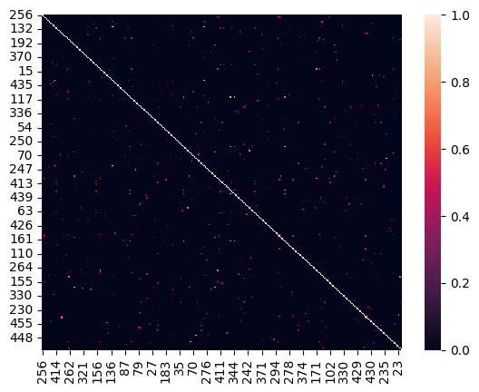
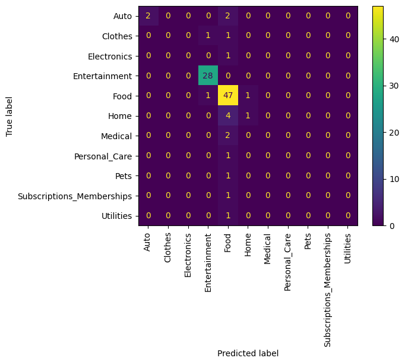
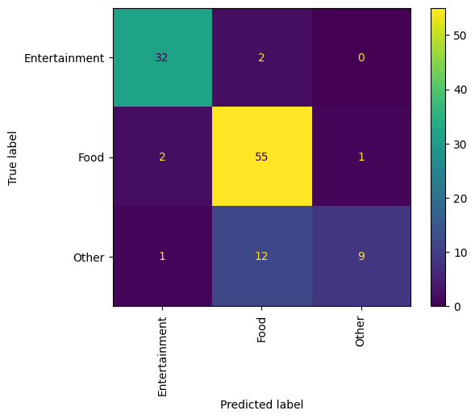

# Problem Statement
Analyse a [dataset](https://drive.google.com/drive/folders/1IxCF-QLFi02knTmUYllnPgedZNzXT_hy?usp=sharing) with a column called description, which is the POS stamp for the transaction, and two other columns for Category and Sub Category. 
Use a notebook of your choice (Jupyter, Google, etc.) and preferably Python as a coding language, to answer the following questions:

1. Given the transaction details columns, can you build a simple model that reads a portion of this data, and without seeing the hold out set, predicts the categories and subcategories? first start by predicting the category and see if you can expand.

2. Can you also build a model which takes in a whole new transaction description (none of those that your model has seen for training and testing), and gives the closest possible category?

# Results
1. Issues:
    - Lack of data has put subcategory prediction is out of reach.
    - Oversampling techniques need a minimum of a few entries to work effectively.
    - Synthetic data generation through LLMs is infeasible for me due to cost of compute.
2. Outcomes:
    - All models are only predicting the top 2 categories.
    - Subcategories could not be reliably predicted.
    - MiniLM embeddings instantly improved performance for even the worst models.
    - Predicting just 'Food', 'Entertainment' and 'Other' improved generalisation, but not anything else.
3. Prediction on unseen data:
    - Results on the test set imply that the performance does generalise to unseen, if the performance was there to begin with.
    - The models cannot come up with new categories for completely unseen data, but they will attempt to classify it as the next best category.

# Analysis Journey
## TL:DR
- Intial Thoughts (13/02/2024): 
    - Identified that all features are categorical and considered using embeddings.
    - Planned to test basic sklearn models and pretrained VAEs.
    - Cautious of using anything too complicated.
- Data Exploration (13/02/2024):
    - Limited exploration due to only 3 features.
    - 400 rows with mostly unique transaction descriptions.
    - Skew in categories, with Entertainment and Food being dominant.
    - Noticed overlap in contents and subcategories unique to their category.
    - Considered using distance measures and pretrained text classification models.
- Model Building (13/02/2024):
    - Explored distance measures like cosine similarity.
    - Considered basic vectorizers like CountVectorizer and TfidfVectorizer.
    - Implemented basic SKlearn models to limited success (SVM, KNN, Bayes).
- Model Building (14/02/2024):
    - Explored LLM embedders like facebook/Data2Vec-text-base and RoBERTa.
    - Data preparation challenges with imbalanced classes.
    - Explored undersampling and oversampling techniques.
    - Tried SMOTE and ADASYN for oversampling.
- Model Building (15/02/2024):
    - Attempted generating synthetic data through LLM queries.
    - Attempted class weights when oversampling techniques didn't work.

## 1. Intial Thoughts - 13/02/2024
Looking at the data, all the features are categorical, so alot of algorithms aren't possible without embedding. There are pretrained embeddings avaliable, but I will also test basic sklearn models to see what the performance is like.

Immediately, I'm thinking I can finish a DT or random forrest using SK learn by tonight, and explore other methods tomorrow. For tomorrow, there are pre-trained VAEs (typically used for embeddings) that I can fine tune for this problem, . I'm cautious of using anything too complicated.

## 2. Data Exploration - 13/02/2024
With only 3 features, exploration is limited.
There are 400 rows, and almost exclusively unique transaction descriptions; mostly nonsense but some overlap in contents. 

looking at the 13 existing categories(keeping in mind unseen categories may exist), Entertainment and Food make up 80% of the data. this makes me worried that naive methods might not really work. Similarly Books make up 95% of the entertaiment category, while food is split 57:43 between groceries and fast food.

All subcategories, except Maintenance, are unique to their category.

Another thing I notices is that many of the descriptions have the same words, except in a different order or with additional words/characters. I could try finding a simple distance measure but not sure if that is any better than using an off the shelf model.

Given the skew in the data, I need to keep an eye on the false positive rate and the precision, and be consious of the fact that some categories may not have been included in this dataset (eg. entertainment:movies)

looking at these as a human, there is a lot of intuitive information in the descriptions, so a pretrained  model text classification model is probably going to work the best. DT and Forrests are not going to be robust to unseen data, or handle the skew well.

## 3. Model Building - 13/02/2024
### Distance Measures
My basic model to vectorise the data without using any complex NN model.
I'm most familiar with cosine similarity, which requires I vectorise the data, typically through word frequency. 

other [options](https://flavien-vidal.medium.com/similarity-distances-for-natural-language-processing-16f63cd5ba55) I am less experienced using include: LCS, Edit Distance and Hamming Distance. 
Hamming and Edit distance out, however LCS might be usable with some finicking.

overall the efficeincy of this method is O(n^2), so another method will be needed to scale (DT, PageRank).

#### Cosine Similarity
the heatmap from the basic cosine similarity on Tfidf vector representations was more sparse than I expected. I think this is mostly on the vectorisation and sampling method. 

I now doubt the efficacy of KNN, which uses cosine similarity, to predict categories with this vectorization method.

### basic vectorisers 
[Medium](https://medium.com/geekculture/how-sklearns-countvectorizer-and-tfidftransformer-compares-with-tfidfvectorizer-a42a2d6d15a2) provides good articles detailing the difference between basic vectorizers availiable in SK learn.
#### Count vectoriser: 
Tokenises the text and counts the frequency of each word.

#### Tfidf vectoriser: 
does the above + normalises the frequency of each word in the corpus.

Tfidf is better for our case as it will decrease the importance of common words. That said I'm mindful of the bias I'm intoducing.

### LLM embedders - 14/02/2024
#### facebook/Data2Vec-text-base
This model could be used to tokenise the data, then use the basic models from before to predict the category. 
#### RoBERTa
This is an established model that i'm more familiar with. I might start with this. 
no need to reinvent the wheel here, a decent guide is [here](https://jesusleal.io/2020/10/20/RoBERTA-Text-Classification/)
#### BAAI/bge-reranker-base
FlagEmbedding, this is another option, but it seems a bit too complicated. it does have the advantage of being multi lingual, but I don't think that is necessary for this task.

## Data preperation
I've pretty much imediately hit a problem, there are 2 catgories with only 1 record, meaning I cannot seperate them into train test and val sets evenly. I have the option of a number of [oversampling methods](https://machinelearningmastery.com/data-sampling-methods-for-imbalanced-classification/), but I might save these for tomorrow and just drop the class for now. looking at the case, I could even generate new entries, but I would have to do the same for the subcategories with similar issues.

After initally dropping the data, I will purse some augmentation methods for the underrepresented classes, perhaps just by querying an LLM for similar values.

I ran into a new issue with SVM, in that it requires lables to be numerical, however the label encoder cannot accept new unknown categories. for this reason I've investigated sklearn.preprocessing.OnHotEncoder which seems to have an ignore option which just refuses to label the entry. not sure how this will work with my confusion matrix tbh.

### Sampling techniques 14/02/2024
Fraud detection methods, sampling and sythnetic data in particular,  are promising since we are targeting underrepresented classes.
Since I don't have many entries for the small samples, I'll try undersampling first, and then over sampling if that has no effect. 
After all of this I will apply sythetic data methods.

Also, stripping grammar and non alphanumeric characters actually hurt performance slightly on the embedded models, and made no differnece to the naive models since the tokenizer already does this. I should still probably do some cleaning, but I'll leave it for now.

for under and over sampling I'm taking the approach detailed [here](https://machinelearningmastery.com/random-oversampling-and-undersampling-for-imbalanced-classification/)

#### Undersampling
It turns out undersampling only gives us like 20 datapoints. It did improve SVM's precision to like 0.4, but whether it will generalise is pretty dubious. 

#### Oversampling
Oversampling combined with undersampling didn't really work. Simple oversampling improved the spread of predictions, but didn't really improve performace much. 

after investigating, it seems like my targeted oversampling isn't really working.

#### SMOTE/ADASYN - 15/02/2024
this oversampling techinque involves generating synthetic data using various methods. I can only use this on the embeddings as it requires continuous data.

SMOTE will generate data using interpolation while ADASYN will use a KNN to try to generate data wich isn't categorised well by the KNN.

These methods don't really work as we need more raw samples to sythesise form. 

#### Synthetic data through LLM queries - 15/02/2024
[Mixtral](https://huggingface.co/mistralai/Mixtral-8x7B-Instruct-v0.1) is a popular easy to use model.

# Solutions
Initial models just predict food and entertainment and nothing else, indicating other sampling or augmentation methods will be needed for the dataset.

all sklearn models performed poorly, KNN and RF particularly so. SVMs performed ok, and might work with better data prep.
## SkLearn models
### KNN -13/02/2024
Simple prep performance:
data | metric | score
--- | --- | ---
Test | F1        | 0.6938558968714562
Test | Accuracy: | 0.7718631178707225
Val | Accuracy: | 0.5087719298245614
Val | F1        | 0.4558903035709458

### Bayes
Simple prep performance:
data | metric | score
--- | --- | ---
Test | Accuracy: | 0.8136882129277566
Test | F1        | 0.7348415318783748
Val | Accuracy: | 0.7456140350877193
Val | F1        | 0.6710382513661203
### SVM

I'm somehow always surprised by SVM's performance.
Simple prep performance: \
data | metric | score
---  | ---    | ---
Test | Accuracy: | 0.9657794676806084
Test | F1        | 0.9624287238171699
**Val** | **Accuracy:** | **0.7543859649122807**
**Val** | **F1**        | **0.6792271898383953**

## Pretrained models

I've chosen to use a LLM embeddings with a simple sklearn model, as it is explainable and reliable. I don't think I have the data to really fine tune the model, so I just use the naitive weights.

looking at hugging face the newer [all-MiniLM-L6-v2](https://huggingface.co/sentence-transformers/all-MiniLM-L6-v2) seems to be hugely popular atm. I imagine that is because it is a smaller model used in tutorials, therfore I'll use this first. 

### MiniLM
MiniLM embeddings instantly improved performance for even the worst models, With further improvements to data prep, I think we have a shot at attempting to predict the subcategories. \
The issue still remains however, that the models are only predicting the top 2 categories.

raw embedded data performance with SVM: \
data  | metric    | score
---   | ---       | ---
Test  | Accuracy: | 0.9011406844106464
Test  | F1 Score  | 0.8801286091193935
**Val**   | **Accuracy:** | **0.7982456140350878**
**Val**   | **F1 Score**  | **0.7256237353827878**

Interestingly this model made one correct prediction other than food and entertainment, for the 'auto' category, while other models still can't do this. 

notably though, none of these models perform well on macro averages, as they are only predicting 2 categories.

attempting the same for subcategories resulted in less impressive classification. \
data  | metric              | score
---   | ---                 | ---
Val   | Precision(macro):   |0.43003155862105896
Val   | Recall(macro):      |0.47886442510098426
**Val**   | **F1 Score(macro):**    |**0.42821507445163354**
**Val**   | **F1 Score(weighted):** |**0.808160552897395**
**Val**   | **Accuracy:**           |**0.8245614035087719**

#### weighted svm
Weighted svm didn't really improve the performance at all, however it was able to correctly classify an extra category.
Precision dropped slightly, but the model was able to correctly classify an extra category.

#### Unseen data
The SVM on embeddings worked quite well for the test set, acheiving a precision of 0.33 on the test set (excluding categories it hadn't trained on). The model is also able to categorize unseen categories to the next best category, but naturally this drops the precision (observed around 0.24 in this case)

the KNN in this case performed even better than expected, matching the SVM's performance and classifying a 3rd class correctly.

data  | metric              | score
---   | ---                 | ---
Test  | Precision(macro):   | 0.2912568306010929
Test  | Recall(macro):      | 0.24174397031539885
Test  | F1 Score(macro):    | 0.2520403316641561
Test  | F1 Score(weighted): | 0.7684468223851164
Test  | Accuracy:           | 0.8210526315789474

weighted SVM had similar performance in test and val. 

### LLM data sythinesis
I attempted to get Mixtral 7b up and running but the download time was excessive, especially as I'm running locally. GeneZC/MiniMA-3B seems more feasible, but the download time is still like 2 hours. This may not be completed in time

### classifying Food,Entertainment + other
I think I can get better performance by just classifying Food, Entertainment and other, then classifying subcategories.

This didn't improve the classificaiton of subcategories, but did improve the generalisation of 2 categories. \

# Post Presentation improvements
## Discussion
During the presentation to the team it was suggested that I move to fasttext encodings and use an autoencoder to represent the categories in like space. this way the svm model will be able to classify vector representations into vector categories.

i'm pretty unfamiliar with the dim reduction techinuqe, I can't tell if its as simple as applying the autoencoder to both input and category and then applying a ML process, or its as simple as applying a simple decoder to the embedded data.

One important aspect I'm struggling to implement, is finding a way to utilise the information stored in the labels. for instance embedding the labels and training to predict the embedded labels.

## Fasttext 
In applying fasttext to the classificaiton problem, I'm struggling to see how to take advantage of dimension reduction techniques. Particularly how if it is useful at all to train a decoder to take embedded data and turn it into a class prediction.

Fasttext is particularly interesting due to their n-gram embeddings, which better handle out of vocabulary words.
That said for a larger dataset many say [Bert based models perform better](https://www.reddit.com/r/LanguageTechnology/comments/11vav4y/are_pretrained_word_embeddings_word2vec_glove/)
Fasttext does have another advantage though, in its explianability and light resource usage.

## Autoencoder Method
Autoencoders can be trained to reproduce the input data from a smaller representation. I should be able to categorise directly on the smaller embeddings, as they should represent some kind of semantics. 

What I'm not sure about is how to choose the best size for the reduction. I will need at least 30 dimensions to represent all subcategories, but I think i'll need more than that.

### Decode to classification
The dimension reduction does help a bit with generalisation, but not a much as I had hoped for. meanwhile my efforts to train a model to directly predict the categorical data have had even better generalisation, but worse performance.

I'm now hoping I can combine the best of both worlds and see if I can get the auto encoder to decode directly into the categorical data, and thus capture the relevant semantics in the smaller embedding.

My intuiton is that this won't work, as I don't really see any difference between this and the other DNN mehtods I've tried.

As expected this worked really poorly.

fine turning fasttext on my corpus might help the model to identify easy sub categories like 'vitamins' being in the category of 'medical' and not food.

# Discussion

After all of that, fast text didn't really help at all. Dimension reduciton using the auto encoder helped the model generalise, but not enough to tackle subcategories, and I don't really know where to take it next as I don't really have any strong intuitions about it.

The next step would be to try using bigger and better models from which to reduce the embedding, or fine tune our embeddings on the corpus a bit.
That or I could go even harder on the NN classifer route, but I would really need to take advantage of a bigger corpus.

given time I'm moving onto my personal projects which have some overlap with this anyway.